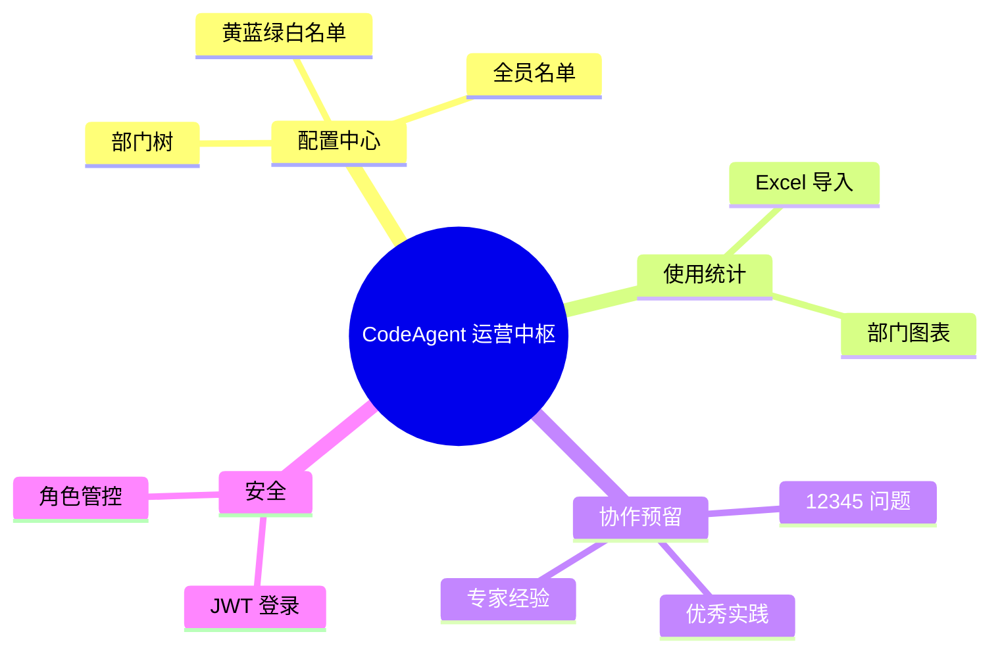
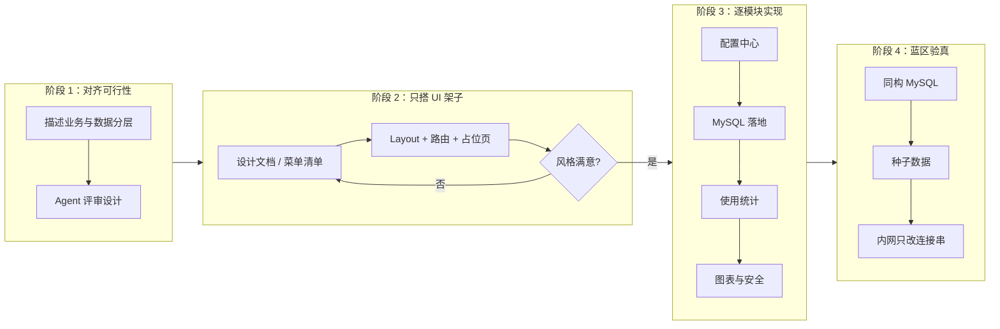
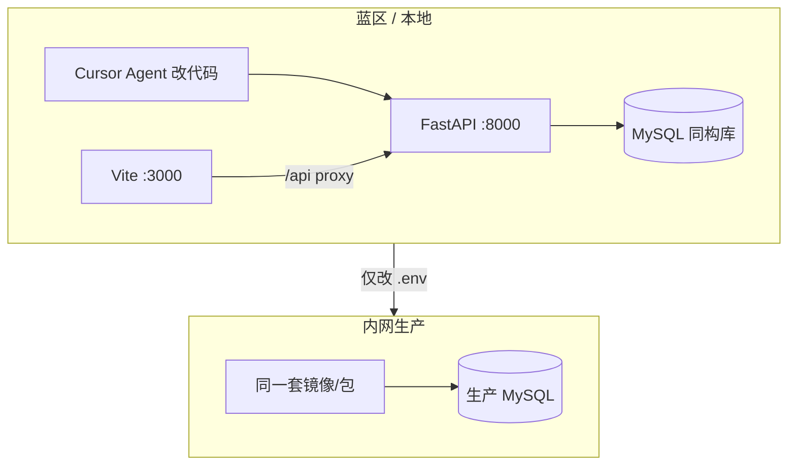
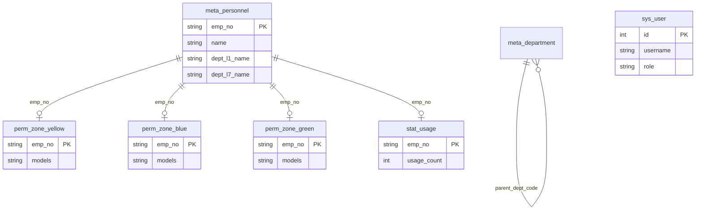
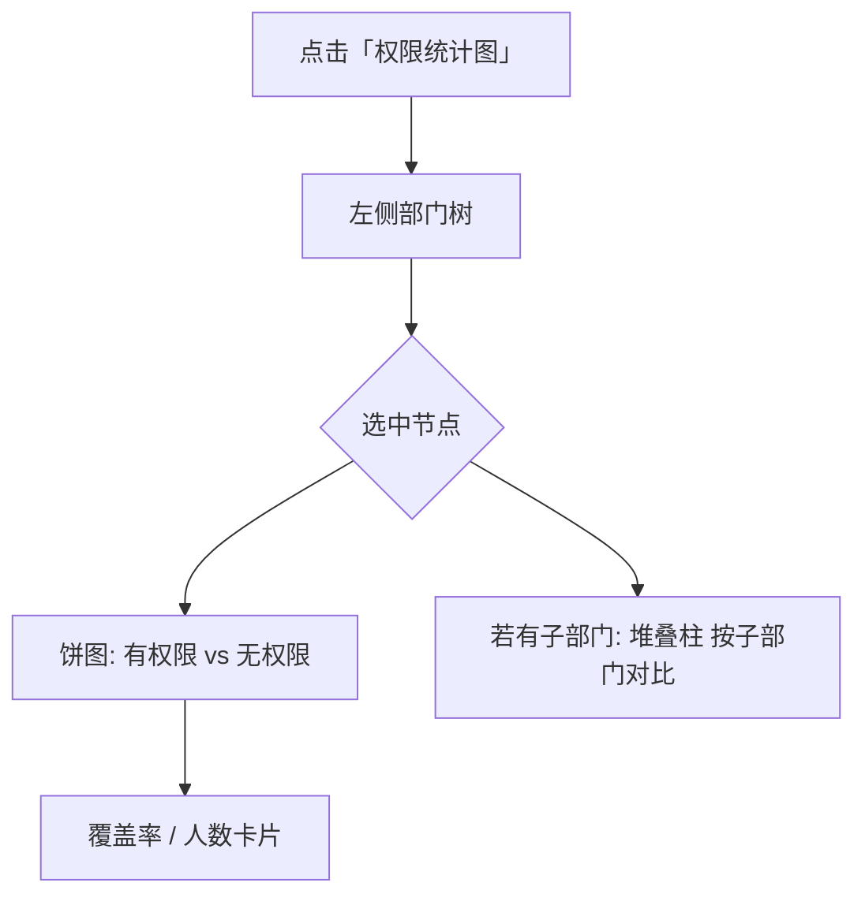
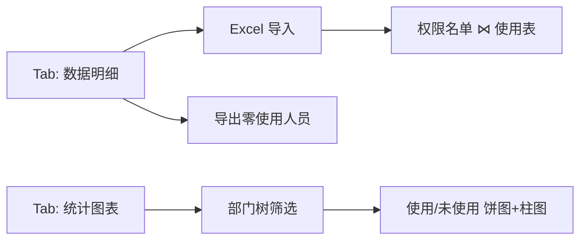

# 用 Cursor 在蓝区「养」出一个运营中枢：CodeAgent Growth Hub 开发实录

> 本文整理自多轮 Agent 会话与 Git 提交记录，记录一套 **Vibe Coding** 工作法：先搭架子、再逐模块「调教」Agent，并在蓝区用真实 MySQL 结构完成验证，最终平滑迁移内网生产。
>
> **配图**：文中预留了 Cursor 对话过程与 Web 成品截图位；将图片放入 [`docs/assets/`](assets/README.md) 对应路径即可显示（详见 [附录 A：截图清单](#附录-a截图清单与放置说明)）。

---

## 配图速览（成稿后展示）

> 下方为双栏预览：左列为 **与 Agent 结对的过程**，右列为 **系统跑起来后的界面**。发布前请替换为你的实际截图。

| 开发过程（Cursor） | 运行效果（Web） |
|-------------------|-----------------|
|  |  |
|  |  |
|  |  |

*若图片暂未放入，编辑器可能显示裂图；按 [附录 A](#附录-a截图清单与放置说明) 命名即可。*

---

## 一、背景：为什么要做这套系统？

团队在推进 **CodeAgent**（含 GUI / CLI）时，运营侧每天要面对大量「看不见摸不着」的问题：

- 黄 / 蓝 / 绿三个网络区域，谁开通了权限？模型清单是否对齐？
- 开通了权限的人，**谁在持续用、谁从未用过**？累计调用频次如何？
- 12345 渠道的问题单进展如何？优秀实践、专家 Skill/MCP 产出如何晾晒？
- 汇报时要按 **部门树** 下钻：PDU、开发部、FSE 各自覆盖率、活跃率是多少？

使用者只有 **十几位内部同事**，不需要做成通用 SaaS，但要 **数据敏感、可快速部署、模块可分工**。于是有了 **CodeAgent 运营中枢（Growth Hub）**：一个轻量 B 端后台，把主数据、权限、使用统计和后续模块入口收拢到一处。



---

## 二、目标功能：七大模块与实现策略

最初需求清单（来自首轮会话）如下。核心决策是：**只亲自做完「配置 + 权限 + 使用」闭环，其余模块只留菜单与占位，交给各条线负责人后续扩展。**

| 模块 | 界面命名 | 负责人策略 | 当前状态 |
|------|----------|------------|----------|
| 配置中心 | 配置中心 | 核心团队 | 已实现 |
| 历史变更 | （后移除） | — | 已砍掉，追求极简 |
| 使用统计 | 使用统计 | 核心团队 | 已实现 |
| 权限看护 | 并入配置中心 | 核心团队 | 已实现（三区 Tab） |
| 12345 问题 | 12345 问题统计 | 预留 | 占位页 |
| 优秀实践 | 优秀实践 | 预留 | 占位页 |
| 专家经验 | 专家经验 | 尝试过 DOM 采集后回退 | 占位页 |

模块注册表即这一思路的代码化表达：

```7:48:frontend/src/config/modules.ts
export const APP_MODULES: AppModule[] = [
  {
    key: 'config',
    title: '配置中心',
    description: '组织架构、人员名单与黄/蓝/绿区网络权限配置',
    // ...
    status: 'ready'
  },
  {
    key: 'usage',
    title: '使用统计',
  // ...
    status: 'ready'
  },
  {
    key: 'issues',
    title: '12345 问题统计',
    status: 'planned'
  },
  // ...
]
```

---

## 三、我的 Vibe Coding 方法论（先架子，再填肉）

这不是「一次性把 PRD 扔给 AI」，而是刻意拆成 **四个阶段**，让 Agent 始终在可控边界里迭代。



### 3.1 阶段 1：先问「能不能做、模型对不对」

第一轮对话没有写代码，而是把 **白名单 → 使用数据 → 问题单/实践** 的分层讲清楚，让 Agent 用 Mermaid 画数据流、指出「使用数据在库表层面不要物理限制为权限子集」（否则无法发现权限外使用）。

**过程截图**


*放置说明：保存为 `docs/assets/agent/01-feasibility-chat.png` — 建议包含你的原始需求 + Agent 回复中的分层表或 Mermaid。*

关键收敛：

- **主数据**：部门树 + 全员名单（工号唯一键）
- **权限**：黄/蓝/绿分表，只看最新清单，不做快照
- **使用**：`工号 + 使用次数`，Excel 导入刷新
- **PDU 接口人**（二期）：管理员管组织，接口人只管本 PDU 名单——设计阶段先记下，MVP 用 admin 跑通

### 3.2 阶段 2：菜单先行，细节留白

明确指令：

> 「基于设计文档实现系统，**别着急开发全部**，先把主菜单列出来，让我确认页面风格没问题，再挨个开发模块。」

Agent 恢复/生成 **Vue 3 + Element Plus + 侧边栏 Layout**，每个业务路由指向 `ModulePlaceholder`，配置中心除外。这一步 **零业务逻辑**，只为确认：

- 品牌区：CodeAgent 运营中枢
- 菜单分组、图标、副标题
- 浅灰背景 + 卡片式内容区

不满意时可以直接说「跟原先没区别」——曾触发 **清空重来 + 前后端一体重写** 的决策（见时间线 4 月 30 日～5 月 23 日）。

**过程截图 · 菜单架子**

| 提示词与 Agent 理解 | 浏览器中的架子效果 |
|---------------------|-------------------|
|  |  |

**成品截图 · 整体框架（阶段 2 验收）**


*对应文件：`agent/02-menu-skeleton-prompt.png`、`agent/03-menu-skeleton-result.png`、`app/02-layout-menu.png`。*

### 3.3 阶段 3：一个模块一轮会话，用「纠正」代替大 PRD

每个模块用 **一条用户消息 = 一个可验收增量**，典型调教方式：

| 调教类型 | 示例原话 | 效果 |
|----------|----------|------|
| 做减法 | 「部门树只要层级和名字，别搞一堆无关字段」 | 表结构收敛为 `dept_code / parent / name` |
| 改数据模型 | 「人员用 7 级部门名字段写死，工号做主键，不必跟部门表 FK」 | `meta_personnel` 扁平层级列 |
| 改交互 | 「表头筛选别别扭，要 Excel 那种勾选下拉」 | Element Plus 列筛选改造 |
| 改架构 | 「黄蓝绿各一页，三表存权限，批量工号+模型」 | `perm_zone_*` 三表 + Tab 页 |
| 改产品 | 「变更记录模块干掉，十几个人用不着」 | 路由与菜单删除 |
| 否定方案 | 「专家经验 DOM 采集先回退」 | 避免不可维护的 Hack |

**过程截图 · 典型「纠正」对话**


### 3.4 阶段 4：蓝区对齐生产，消灭「联调惊喜」

内网部署最怕：本地 Mock 一套、上线 MySQL 另一套。做法是：

1. **蓝区开发机** 安装与生产同版本的 MySQL，库名、表结构与 `backend/docs/schema.mysql.sql` 一致  
2. 应用只读 `.env` 中的连接串，**代码零分支**  
3. 用 `seed_demo_data.py` 写入组织架构、23 人样本、三区权限、使用次数，直接看饼图/柱状图  
4. 上生产：**只改 `DATABASE_URL` / MySQL 主机**，不做结构漂移  



---

## 四、工具链：我用什么、Agent 用什么

| 类别 | 工具 | 用途 |
|------|------|------|
| IDE / Agent | **Cursor**（Composer Agent） | 全流程 Vibe Coding：读仓库、改前后端、跑终端、修端口 |
| 前端 | Vue 3、Vite、TypeScript、Pinia、Vue Router | SPA 与模块路由 |
| UI | Element Plus | 表格、树、对话框、登录页 |
| 图表 | ECharts | 权限覆盖率饼图、子部门堆叠柱、使用分布 |
| 后端 | FastAPI、SQLAlchemy、Pydantic | REST API |
| 数据库 | MySQL 8 | 与生产同构 |
| 安全 | JWT（HttpOnly Cookie）、bcrypt/passlib | 登录与会话 |
| 协作 | Git、`develop` 分支 | 按功能提交，多次「提交上库」 |

Agent 的典型能力组合：**语义搜索代码 → 读设计文档 → 并行改 10+ 文件 → `npm run build` / `uvicorn` 验证 → 根据你的口语反馈再改一轮。**

---

## 五、数据架构（最终落地）



**度量关系（逻辑上）**：

```text
全员名单 ──⊃── 某区权限名单 ──⊃── 有使用记录的人（统计默认）
                │
                └── 使用次数=0 → 「开通未用」导出名单
```

---

## 六、会话时间线（按主题归纳）

> 日期来自 Git 提交；会话内容来自 Cursor Agent Transcripts。同一主题可能跨多天、多轮对话。

### 2026-04-30 · 立项与原型

| 动作 | 说明 |
|------|------|
| 需求探讨 | 白名单、使用监控、问题单、优秀实践、部门筛选、图表 |
| Agent 输出 | 可行性分析、三层数据模型、MVP 顺序建议 |
| 代码 | 从 `ops-ai-web` 迁入前端；`Initial commit` |

<!-- 截图（可选）：立项阶段对话可复用 agent/01-feasibility-chat.png -->

### 2026-04-30 ～ 5 月初 · 设计文档与「推倒重来」

- 输出/迭代 `ai-ops-system-design-v2` 等设计说明  
- 用户反馈：「不如重新实现」→ **清空旧代码**，前后端一体，12345/优秀实践仅菜单  
- 登录：固定账号 + 简单 JWT，拒绝过度工程  

### 2026-05-23 · 配置中心 + MySQL 一体化（密集交付日）

Git 上可见单日多次提交，对应一整天的 Agent 结对：

```text
5462727  Add config center with FastAPI backend and refactor frontend modules
3ddbebc  Align .env.example with local MySQL defaults
9ffa574  Add usage statistics module with Excel import and roster merge
bf933d7  Add zone permission coverage charts with department filtering
57e4aee  Add usage distribution charts and remove audit module
8016de5  Add JWT login, role-based access, and system user management
```

**配置中心（会话要点）**

1. 部门树：单根、子节点、批量添加（逗号分隔）  
2. 人员名单：工号批量录入、HR 查部门、异常行导出 Excel  
3. 纠正「研发部,产品部」类脏数据；改为 7 级部门列 + 工号 PK  
4. 表头筛选改为「列头下拉勾选」  
5. 黄/蓝/绿三个 Tab 独立白名单表；去掉工具名字段；去掉独立「权限看护」菜单  
6. 对接本地 MySQL，去掉 Mock  

**使用统计**

- Excel 导入 `工号 + 使用次数`  
- 页面 = 权限名单 LEFT JOIN 使用表  
- 匹配失败行可导出，且**不阻塞**成功行写入  
- UI：Tab1 表格 / Tab2 图表；零使用人员可导出（含完整部门列）  
- 交互纠正：「导入按钮」放回表格工具区，而非页面顶部  

**权限图表**

- 配置中心每区「权限统计图」：饼图（有/无权限）+ 选部门后子级堆叠柱  
- 使用统计：部门树筛选 + 使用/未使用分布  

**过程截图 · 图表需求**


**成品截图 · 配置与统计（5/23 密集交付）**

| 配置中心 | 使用统计 |
|----------|----------|
|  |  |
|  |  |
|  | |
|  | |

**安全**

- 砍掉变更记录模块  
- `sys_user` + 管理员维护账号 + 首次登录改密策略讨论  
- 实现 Cookie JWT、角色（admin / viewer 等）  

**过程截图 · 鉴权**


**成品截图 · 登录**


### 2026-05-26 · 模型精炼与演示数据

| 提交 / 会话 | 内容 |
|-------------|------|
| `f161798` | `meta_department` 主键改为字符串 `dept_code`；批量「名称,编码」 |
| 种子脚本 | `seed_demo_data.py`：6 层组织、23 人、三区权限、使用次数 |
| 运维 | 前后端重启、修正 Vite 代理 8000/8001、admin 密码重置 |

**尚未落地的探索**

- **专家经验**：曾讨论 iframe + 脚本注入 DOM 采集 Skill/MCP → 用户判断「行不通」→ **整模块回退为占位**  

<!-- 截图（可选）：专家经验回退对话 → assets/agent/08-expertise-rollback.png -->

- **PDU 接口人权限**：设计已记录，代码仍以 admin 为主  

---

## 七、Agent 调教实录：几句原话，撬动大改动

下面摘录 **真实用户指令**（略作标点整理），展示 Vibe Coding 里「人」的作用——不是写代码，而是 **定边界、砍 scope、纠交互**。

### 7.1 做减法

> 「你是不是做复杂了，部门树只需要有个层级关系以及名字即可。」

→ 触发对 ORM、API、页面的同步瘦身。


### 7.2 定数据哲学

> 「人员属于哪个部门直接写死一～七级部门名字段……人员工号做主键就可以了，不要单独的 id。」

→ 报表与筛选极大简化；部门树仅服务「按树筛选」。

### 7.3 产品决策

> 「如果系统只有十几个人用，是不是也没必要搞配置的记录查询了？」  
> 「那就把变更记录的模块干掉吧。」

→ 少一张表、少一路由、少一次 Agent 误伤范围。

### 7.4 体验细节

> 「导入按钮放到头部会不会有些别扭？毕竟导入的数据最先作用在表里面，然后才生成图。」

→ Agent 调整工具栏布局——这类反馈 LLM 不会自己猜到。

### 7.5 否定不可维护方案

> 「专家经验……内嵌网站 + 注入脚本抓数据……能做到吗？」  
> （尝试后）「先回退吧，这个方式行不通。」

→ **及时止损** 比「勉强上线」更重要；占位页留给后续正规 API。


---

## 八、界面与图表：长什么样？

> 本节除示意图外，**以实际运行截图为准**（见 `docs/assets/app/`）。发帖时建议用高清全屏截图，比 ASCII 示意图更有说服力。

### 8.0 成品界面一览

| 模块 | 截图 |
|------|------|
| 登录 |  |
| 框架与菜单 |  |
| 组织架构 |  |
| 人员名单 |  |
| 黄区权限 |  |
| 权限统计 |  |
| 使用明细 |  |
| 使用图表 |  |
| 协作占位 |  |

*最后一项可选；若未截图可删除该行或保留占位文件名待补。*

### 8.1 布局骨架（阶段 2 产物）

```text
┌─────────────────────────────────────────────────────────────┐
│  CodeAgent 运营中枢                    [用户] [退出]         │
├──────────────┬──────────────────────────────────────────────┤
│ 配置中心      │  ┌─────────────────────────────────────────┐ │
│ 使用统计      │  │  模块标题 / 面包屑                        │ │
│ 12345 问题    │  │  ┌───────────────────────────────────┐  │ │
│ 优秀实践      │  │  │  业务内容（表格 / 树 / 图表）          │  │ │
│ 专家经验      │  │  └───────────────────────────────────┘  │ │
│              │  └─────────────────────────────────────────┘ │
└──────────────┴──────────────────────────────────────────────┘
```

### 8.2 权限统计弹窗（逻辑）



**成品对照**


### 8.3 使用统计 Tab（逻辑）



**成品对照**

| 数据明细 Tab | 统计图表 Tab |
|--------------|--------------|
|  |  |

---

## 九、蓝区 vs 生产：我如何保证「不冲突」

| 实践 | 说明 |
|------|------|
| 同构 DDL | `schema.mysql.sql` 与 SQLAlchemy Models 双轨一致 |
| 配置外置 | `backend/.env` 仅放连接串；**.env 不提交**，`.env.example` 提交模板 |
| 无环境分支代码 | 不在代码里写 `if prod` 换表结构 |
| 种子数据可选 | `scripts/seed_demo_data.py` 仅蓝区/本地演示，生产由真实导入填充 |
| 迁移意识 | 例如 `dept_code` 从 int 改 string 时，脚本内带「检测旧表 → 重建」提示，避免 Agent  silently 坏库 |

**价值**：在蓝区把「导入异常 Excel」「零使用导出」「三区饼图」全点一遍，上内网时只剩 **网络与账号** 问题，而不是业务逻辑 surprise。

---

## 十、Cursor + 蓝区：带来了什么？

### 10.1 Cursor 的价值

1. **上下文感知**：能同时读 `schema.mysql.sql`、Router、Vue 组件，改部门主键时前后端一次改完。  
2. **执行闭环**：装 `echarts`、起 `uvicorn`、查端口占用、修代理——不是只给片段。  
3. **对话即迭代**：用口语纠正比写 Jira 更快；适合 **10 人规模、快反** 的内部工具。  
4. **风险**：会「过度设计」（外键、多余字段）——需要人像本文一样 **及时砍需求**。

**建议发帖时展示的「过程三连」**（请替换为你的截图）：

1. `agent/02-menu-skeleton-prompt.png` — 一句口语需求  
2. `agent/04-simplify-dept-prompt.png` — 一次纠正  
3. `agent/06-charts-prompt.png` — 一次功能增量  


*若做了拼图，可新增 `process-trio.png` 并只保留上图一处引用；否则保留上文三处分散引用即可。*

### 10.2 蓝区的价值

1. **真实 MySQL**：图表、导入、登录都走真连接，告别 JSON Mock。  
2. **敏感数据不出域**：运营数据在蓝区造样本即可验证 UI。  
3. **与生产同路径**：Docker/静态资源部署时，只是换库地址。

---

## 十一、经验清单（给想复制这套玩法的人）

1. **先菜单后业务**：半天确认 Layout，胜过两周返工 UI。  
2. **模块注册表 + 占位页**：多人协作时，边界清晰。  
3. **一条消息一个验收点**：「批量添加子部门」「三区拆表」分开说。  
4. **敢砍功能**：审计日志、专家 DOM 采集，不适合就别硬上。  
5. **数据模型用业务语言钉死**：「工号 PK」「七级部门列」——Agent 不会和你争论第二遍。  
6. **图表跟部门树绑定**：一次实现 `zonePermissionStats.ts`，黄蓝绿复用。  
7. **蓝区 MySQL 先行**：内网部署变成配置问题，不是开发问题。  
8. **提交粒度**：功能块稳定就 `git commit`，方便回滚 Agent 误改。

---

## 十二、当前仓库一览（便于读者对照）

```text
CodeAgent-Growth-Hub/
├── frontend/          # Vue3 + Element Plus + ECharts
│   └── src/views/
│       ├── config/    # 组织、人员、黄蓝绿权限
│       ├── usage/     # 导入 + 图表 Tab
│       └── …/         # issues / practices / expertise 占位
├── backend/           # FastAPI
│   ├── app/routers/   # auth, departments, personnel, zone_permissions, usage_stats
│   ├── docs/schema.mysql.sql
│   └── scripts/seed_demo_data.py
└── docs/
    ├── vibe-coding-timeline.md   # 本文
    └── assets/
        ├── agent/                  # Cursor 过程截图
        └── app/                    # Web 效果截图
```

**本地启动（蓝区参考）**

```bash
# 后端
cd backend && .venv/bin/uvicorn app.main:app --reload --port 8000

# 前端
cd frontend && npm run dev
# 浏览器 http://localhost:3000

# 演示数据
cd backend && PYTHONPATH=. .venv/bin/python scripts/seed_demo_data.py
```

---

## 十三、结语

这套 **CodeAgent 运营中枢** 不是一次 prompt 的奇迹，而是：

- **产品分层**（主数据 → 权限 → 使用）想清楚了；  
- **Cursor Agent** 负责体力活；  
- **人** 负责砍 scope、纠交互、否决 Hack；  
- **蓝区 MySQL** 负责把最后一公里验证掉。

若你也在内网推 AI 工具运营，不妨复制这条路径：**菜单骨架 → 单模块调教 → 同构库验真 → 内网只改配置**。十几人的工具，值得用 Vibe Coding 快做；不值得过度工程。

---

## 附录 A：截图清单与放置说明

### 目录结构

```text
docs/assets/
├── README.md           # 文件名对照表（本仓库已提供）
├── agent/              # 与 Cursor Agent 交互的过程
│   ├── 01-feasibility-chat.png
│   ├── 02-menu-skeleton-prompt.png
│   ├── 03-menu-skeleton-result.png
│   ├── 04-simplify-dept-prompt.png
│   ├── 05-mysql-connect.png
│   ├── 06-charts-prompt.png
│   ├── 07-auth-discuss.png
│   ├── 08-expertise-rollback.png   # 可选
│   └── process-trio.png            # 可选，三张过程图拼图
└── app/                # 系统运行效果
    ├── 01-login.png
    ├── 02-layout-menu.png
    ├── 03-config-dept-tree.png
    ├── 04-config-personnel.png
    ├── 05-config-zone-yellow.png
    ├── 06-config-zone-stats.png
    ├── 07-usage-table.png
    ├── 08-usage-charts.png
    └── 09-placeholder-module.png   # 可选
```

### 操作步骤

1. 将你已截好的图 **按上表文件名复制** 到 `docs/assets/agent/` 或 `docs/assets/app/`。  
2. 用 VS Code / Cursor 打开本 Markdown，预览应能看到图片。  
3. 若文件名不同，只需全文搜索 `assets/agent/` 或 `assets/app/` 替换路径。  
4. 发帖到不支持相对路径的平台时：可把 `docs/assets/` 打成 zip 上传图床，并把链接改为绝对 URL。

### 正文中的引用位置速查

| 文件 | 出现章节 |
|------|----------|
| `agent/01` | §3.1、配图速览 |
| `agent/02`、`03` | §3.2、配图速览 |
| `agent/04` | §3.3、§7.1 |
| `agent/05` | §3.3 |
| `agent/06` | §6（5/23）、§10.1 |
| `agent/07` | §6 安全 |
| `agent/08` | §6、§7.5（可选） |
| `app/01`～`08` | §6、§8.0、§8.2～8.3、配图速览 |
| `app/09` | §8.0（可选） |

### 发帖排版建议

- **过程图**：适当裁掉无关窗口，保留「你的 prompt + Agent 关键回复」。  
- **效果图**：优先全屏浏览器，侧栏 + 主内容区完整可见。  
- **敏感信息**：内网 URL、真实工号姓名打码；发帖用副本，勿直接提交未脱敏原图到公网仓库。

---

*文档版本：2026-05-26 · 与仓库 `develop` 分支提交 `f161798` 对齐 · 含截图占位 v2*
